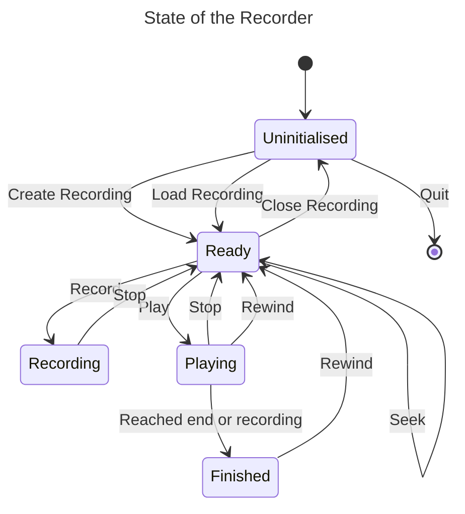
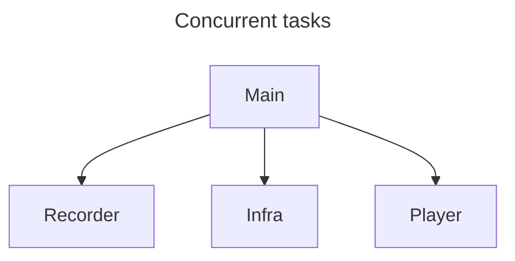
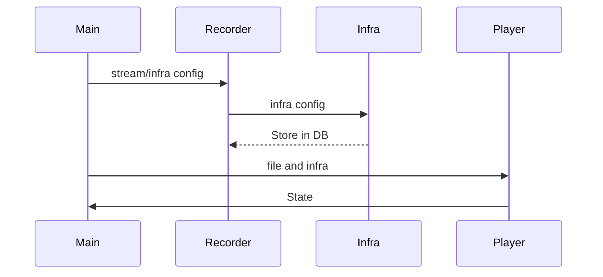

# Network Recorder / Player

Task structures:

- Main - receive commands, output state and errors
- Recorder - receives packets from Infra outputs, stores in the DB per x period or y packets.
- Player - Fetch a series (amount of time) from DB and output via Infra
- Infra - per stream (socket) jobs

